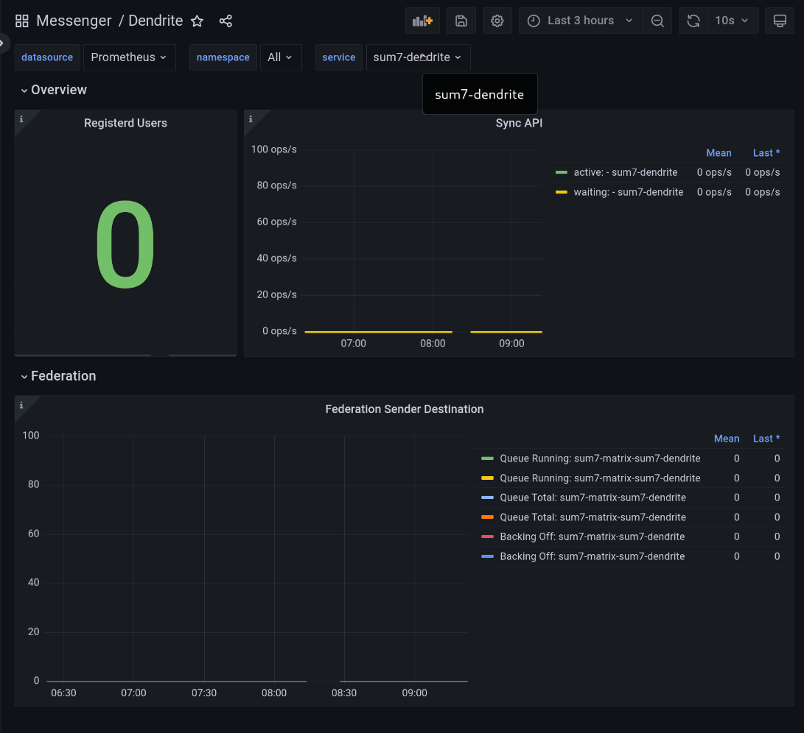

# dendrite

  
Dendrite Matrix Homeserver

Status: **NOT PRODUCTION READY**

## About

This chart creates a monolith deployment, including an optionally enabled PostgreSQL dependency to connect to.

## Manual database creation

(You can skip this, if you're deploying the PostgreSQL dependency)

You'll need to create the following database before starting Dendrite (see [installation](https://matrix-org.github.io/dendrite/installation/database#single-database-creation)):

```postgres
create database dendrite
```

or

```bash
sudo -u postgres createdb -O dendrite -E UTF-8 dendrite
```

## Usage with appservices

Create a folder `appservices` and place your configurations in there.  The configurations will be read and placed in a secret `dendrite-appservices-conf`.

## Source Code

* <https://github.com/matrix-org/dendrite>
## Requirements

| Repository | Name | Version |
|------------|------|---------|
| https://charts.bitnami.com/bitnami | postgresql | 12.1.7 |
## Values

| Key | Type | Default | Description |
|-----|------|---------|-------------|
| image.repository | string | `"ghcr.io/matrix-org/dendrite-monolith"` | Docker repository/image to use |
| image.pullPolicy | string | `"IfNotPresent"` | Kubernetes pullPolicy |
| image.tag | string | `""` | Overrides the image tag whose default is the chart appVersion. |
| signing_key.create | bool | `true` | Create a new signing key, if not exists |
| signing_key.existingSecret | string | `""` | Use an existing secret |
| resources | object | sets some sane default values | Default resource requests/limits. |
| persistence.storageClass | string | `""` | The storage class to use for volume claims. Used unless specified at the specific component. Defaults to the cluster default storage class. |
| persistence.jetstream.existingClaim | string | `""` | Use an existing volume claim for jetstream |
| persistence.jetstream.capacity | string | `"1Gi"` | PVC Storage Request for the jetstream volume |
| persistence.jetstream.storageClass | string | `""` | The storage class to use for volume claims. Defaults to persistence.storageClass |
| persistence.media.existingClaim | string | `""` | Use an existing volume claim for media files |
| persistence.media.capacity | string | `"1Gi"` | PVC Storage Request for the media volume |
| persistence.media.storageClass | string | `""` | The storage class to use for volume claims. Defaults to persistence.storageClass |
| persistence.search.existingClaim | string | `""` | Use an existing volume claim for the fulltext search index |
| persistence.search.capacity | string | `"1Gi"` | PVC Storage Request for the search volume |
| persistence.search.storageClass | string | `""` | The storage class to use for volume claims. Defaults to persistence.storageClass |
| extraVolumes | list | `[]` | Add additional volumes to the Dendrite Pod |
| extraVolumeMounts | list | `[]` | Configure additional mount points volumes in the Dendrite Pod |
| strategy.type | string | `"RollingUpdate"` | Strategy to use for rolling updates (e.g. Recreate, RollingUpdate) If you are using ReadWriteOnce volumes, you should probably use Recreate |
| strategy.rollingUpdate.maxUnavailable | string | `"25%"` | Maximum number of pods that can be unavailable during the update process |
| strategy.rollingUpdate.maxSurge | string | `"25%"` | Maximum number of pods that can be scheduled above the desired number of pods |
| dendrite_config.version | int | `2` |  |
| dendrite_config.global.server_name | string | `""` | **REQUIRED** Servername for this Dendrite deployment. |
| dendrite_config.global.private_key | string | `"/etc/dendrite/secrets/signing.key"` | The private key to use. (**NOTE**: This is overriden in Helm) |
| dendrite_config.global.well_known_server_name | string | `""` | The server name to delegate server-server communications to, with optional port e.g. localhost:443 |
| dendrite_config.global.well_known_client_name | string | `""` | The server name to delegate client-server communications to, with optional port e.g. localhost:443 |
| dendrite_config.global.trusted_third_party_id_servers | list | `["matrix.org","vector.im"]` | Lists of domains that the server will trust as identity servers to verify third party identifiers such as phone numbers and email addresses. |
| dendrite_config.global.old_private_keys | string | `nil` | The paths and expiry timestamps (as a UNIX timestamp in millisecond precision) to old signing keys that were formerly in use on this domain name. These keys will not be used for federation request or event signing, but will be provided to any other homeserver that asks when trying to verify old events. |
| dendrite_config.global.disable_federation | bool | `false` | Disable federation. Dendrite will not be able to make any outbound HTTP requests to other servers and the federation API will not be exposed. |
| dendrite_config.global.key_validity_period | string | `"168h0m0s"` |  |
| dendrite_config.global.database.connection_string | string | `""` | The connection string for connections to Postgres. This will be set automatically if using the Postgres dependency |
| dendrite_config.global.database.max_open_conns | int | `90` | Default database maximum open connections |
| dendrite_config.global.database.max_idle_conns | int | `5` | Default database maximum idle connections |
| dendrite_config.global.database.conn_max_lifetime | int | `-1` | Default database maximum lifetime |
| dendrite_config.global.jetstream.storage_path | string | `"/data/jetstream"` | Persistent directory to store JetStream streams in. |
| dendrite_config.global.jetstream.addresses | list | `[]` | NATS JetStream server addresses if not using internal NATS. |
| dendrite_config.global.jetstream.topic_prefix | string | `"Dendrite"` | The prefix for JetStream streams |
| dendrite_config.global.jetstream.in_memory | bool | `false` | Keep all data in memory. (**NOTE**: This is overriden in Helm to `false`) |
| dendrite_config.global.jetstream.disable_tls_validation | bool | `true` | Disables TLS validation. This should **NOT** be used in production. |
| dendrite_config.global.cache.max_size_estimated | string | `"1gb"` | The estimated maximum size for the global cache in bytes, or in terabytes, gigabytes, megabytes or kilobytes when the appropriate 'tb', 'gb', 'mb' or 'kb' suffix is specified. Note that this is not a hard limit, nor is it a memory limit for the entire process. A cache that is too small may ultimately provide little or no benefit. |
| dendrite_config.global.cache.max_age | string | `"1h"` | The maximum amount of time that a cache entry can live for in memory before it will be evicted and/or refreshed from the database. Lower values result in easier admission of new cache entries but may also increase database load in comparison to higher values, so adjust conservatively. Higher values may make it harder for new items to make it into the cache, e.g. if new rooms suddenly become popular. |
| dendrite_config.global.report_stats.enabled | bool | `false` | Configures phone-home statistics reporting. These statistics contain the server name, number of active users and some information on your deployment config. We use this information to understand how Dendrite is being used in the wild. |
| dendrite_config.global.report_stats.endpoint | string | `"https://matrix.org/report-usage-stats/push"` | Endpoint to report statistics to. |
| dendrite_config.global.presence.enable_inbound | bool | `false` | Controls whether we receive presence events from other servers |
| dendrite_config.global.presence.enable_outbound | bool | `false` | Controls whether we send presence events for our local users to other servers. (_May increase CPU/memory usage_) |
| dendrite_config.global.server_notices.enabled | bool | `false` | Server notices allows server admins to send messages to all users on the server. |
| dendrite_config.global.server_notices.local_part | string | `"_server"` | The local part for the user sending server notices. |
| dendrite_config.global.server_notices.display_name | string | `"Server Alerts"` | The display name for the user sending server notices. |
| dendrite_config.global.server_notices.avatar_url | string | `""` | The avatar URL (as a mxc:// URL) name for the user sending server notices. |
| dendrite_config.global.server_notices.room_name | string | `"Server Alerts"` |  |
| dendrite_config.global.metrics.enabled | bool | `false` | Whether or not Prometheus metrics are enabled. |
| dendrite_config.global.metrics.basic_auth.user | string | `"metrics"` | HTTP basic authentication username |
| dendrite_config.global.metrics.basic_auth.password | string | `"metrics"` | HTTP basic authentication password |
| dendrite_config.global.dns_cache.enabled | bool | `false` | Whether or not the DNS cache is enabled. |
| dendrite_config.global.dns_cache.cache_size | int | `256` | Maximum number of entries to hold in the DNS cache |
| dendrite_config.global.dns_cache.cache_lifetime | string | `"10m"` | Duration for how long DNS cache items should be considered valid ([see time.ParseDuration](https://pkg.go.dev/time#ParseDuration) for more) |
| dendrite_config.global.profiling.enabled | bool | `false` | Enable pprof. You will need to manually create a port forwarding to the deployment to access PPROF, as it will only listen on localhost and the defined port. e.g. `kubectl port-forward deployments/dendrite 65432:65432` |
| dendrite_config.global.profiling.port | int | `65432` | pprof port, if enabled |
| dendrite_config.mscs | object | `{"mscs":[]}` | Configuration for experimental MSC's. (Valid values are: msc2836) |
| dendrite_config.app_service_api.disable_tls_validation | bool | `false` | Disable the validation of TLS certificates of appservices. This is not recommended in production since it may allow appservice traffic to be sent to an insecure endpoint. |
| dendrite_config.app_service_api.config_files | list | `[]` | Appservice config files to load on startup. (**NOTE**: This is overriden by Helm, if a folder `./appservices/` exists) |
| dendrite_config.client_api.registration_disabled | bool | `true` | Prevents new users from being able to register on this homeserver, except when using the registration shared secret below. |
| dendrite_config.client_api.guests_disabled | bool | `true` |  |
| dendrite_config.client_api.registration_shared_secret | string | `""` | If set, allows registration by anyone who knows the shared secret, regardless of whether registration is otherwise disabled. |
| dendrite_config.client_api.enable_registration_captcha | bool | `false` | enable reCAPTCHA registration |
| dendrite_config.client_api.recaptcha_public_key | string | `""` | reCAPTCHA public key |
| dendrite_config.client_api.recaptcha_private_key | string | `""` | reCAPTCHA private key |
| dendrite_config.client_api.recaptcha_bypass_secret | string | `""` | reCAPTCHA bypass secret |
| dendrite_config.client_api.recaptcha_siteverify_api | string | `""` |  |
| dendrite_config.client_api.turn.turn_user_lifetime | string | `"24h"` | Duration for how long users should be considered valid ([see time.ParseDuration](https://pkg.go.dev/time#ParseDuration) for more) |
| dendrite_config.client_api.turn.turn_uris | list | `[]` |  |
| dendrite_config.client_api.turn.turn_shared_secret | string | `""` |  |
| dendrite_config.client_api.turn.turn_username | string | `""` | The TURN username |
| dendrite_config.client_api.turn.turn_password | string | `""` | The TURN password |
| dendrite_config.client_api.rate_limiting.enabled | bool | `true` | Enable rate limiting |
| dendrite_config.client_api.rate_limiting.threshold | int | `20` | After how many requests a rate limit should be activated |
| dendrite_config.client_api.rate_limiting.cooloff_ms | int | `500` | Cooloff time in milliseconds |
| dendrite_config.client_api.rate_limiting.exempt_user_ids | string | `nil` | Users which should be exempt from rate limiting |
| dendrite_config.federation_api.send_max_retries | int | `16` | Federation failure threshold. How many consecutive failures that we should tolerate when sending federation requests to a specific server. The backoff is 2**x seconds, so 1 = 2 seconds, 2 = 4 seconds, 3 = 8 seconds, etc. The default value is 16 if not specified, which is circa 18 hours. |
| dendrite_config.federation_api.disable_tls_validation | bool | `false` | Disable TLS validation. This should **NOT** be used in production. |
| dendrite_config.federation_api.prefer_direct_fetch | bool | `false` |  |
| dendrite_config.federation_api.disable_http_keepalives | bool | `false` | Prevents Dendrite from keeping HTTP connections open for reuse for future requests. Connections will be closed quicker but we may spend more time on TLS handshakes instead. |
| dendrite_config.federation_api.key_perspectives | list | See value.yaml | Perspective keyservers, to use as a backup when direct key fetch requests don't succeed. |
| dendrite_config.media_api.base_path | string | `"/data/media_store"` | The path to store media files (e.g. avatars) in |
| dendrite_config.media_api.max_file_size_bytes | int | `10485760` | The max file size for uploaded media files |
| dendrite_config.media_api.dynamic_thumbnails | bool | `false` |  |
| dendrite_config.media_api.max_thumbnail_generators | int | `10` | The maximum number of simultaneous thumbnail generators to run. |
| dendrite_config.media_api.thumbnail_sizes | list | See value.yaml | A list of thumbnail sizes to be generated for media content. |
| dendrite_config.sync_api.real_ip_header | string | `"X-Real-IP"` | This option controls which HTTP header to inspect to find the real remote IP address of the client. This is likely required if Dendrite is running behind a reverse proxy server. |
| dendrite_config.sync_api.search | object | `{"enabled":true,"index_path":"/data/search","language":"en"}` | Configuration for the full-text search engine. |
| dendrite_config.sync_api.search.enabled | bool | `true` | Whether fulltext search is enabled. |
| dendrite_config.sync_api.search.index_path | string | `"/data/search"` | The path to store the search index in. |
| dendrite_config.sync_api.search.language | string | `"en"` | The language most likely to be used on the server - used when indexing, to ensure the returned results match expectations. A full list of possible languages can be found [here](https://github.com/matrix-org/dendrite/blob/76db8e90defdfb9e61f6caea8a312c5d60bcc005/internal/fulltext/bleve.go#L25-L46) |
| dendrite_config.user_api.bcrypt_cost | int | `10` | bcrypt cost to use when hashing passwords. (ranges from 4-31; 4 being least secure, 31 being most secure; _NOTE: Using a too high value can cause clients to timeout and uses more CPU._) |
| dendrite_config.user_api.openid_token_lifetime_ms | int | `3600000` | OpenID Token lifetime in milliseconds. |
| dendrite_config.user_api.push_gateway_disable_tls_validation | bool | `false` |  |
| dendrite_config.user_api.auto_join_rooms | list | `[]` | Rooms to join users to after registration |
| dendrite_config.logging | list | `[{"level":"info","type":"std"}]` | Default logging configuration |
| postgresql.enabled | bool | See value.yaml | Enable and configure postgres as the database for dendrite. |
| postgresql.image.repository | string | `"bitnami/postgresql"` |  |
| postgresql.image.tag | string | `"15.1.0"` |  |
| postgresql.auth.username | string | `"dendrite"` |  |
| postgresql.auth.password | string | `"changeme"` |  |
| postgresql.auth.database | string | `"dendrite"` |  |
| postgresql.persistence.enabled | bool | `false` |  |
| ingress.enabled | bool | `false` | Create an ingress for the deployment |
| ingress.className | string | `""` | The ingressClass to use. Will be converted to annotation if not yet supported. |
| ingress.annotations | object | `{}` | Extra, custom annotations |
| ingress.hostName | string | `""` | The ingress hostname for your matrix server. Should align with the server_name and well_known_* hosts. If not set, generated from the dendrite_config values. |
| ingress.tls | list | `[]` | TLS configuration. Should contain information for the server_name and well-known hosts. Alternatively, set tls.generate=true to generate defaults based on the dendrite_config. |
| service.type | string | `"ClusterIP"` |  |
| service.port | int | `8008` |  |
| prometheus.servicemonitor.enabled | bool | `false` | Enable ServiceMonitor for Prometheus-Operator for scrape metric-endpoint |
| prometheus.servicemonitor.labels | object | `{}` | Extra Labels on ServiceMonitor for selector of Prometheus Instance |
| prometheus.rules.enabled | bool | `false` | Enable PrometheusRules for Prometheus-Operator for setup alerting |
| prometheus.rules.labels | object | `{}` | Extra Labels on PrometheusRules for selector of Prometheus Instance |
| prometheus.rules.additionalRules | list | `[]` | additional alertrules (no default alertrules are provided) |
| grafana.dashboards.enabled | bool | `false` |  |
| grafana.dashboards.labels | object | `{"grafana_dashboard":"1"}` | Extra Labels on ConfigMap for selector of grafana sidecar |
| grafana.dashboards.annotations | object | `{}` | Extra Annotations on ConfigMap additional config in grafana sidecar |

## Monitoring



* Works well with [Prometheus Operator](https://prometheus-operator.dev/) ([Helmchart](https://artifacthub.io/packages/helm/prometheus-community/kube-prometheus-stack)) and their setup of [Grafana](https://grafana.com/grafana/), by enabling the following values:
```yaml
dendrite_config:
  global:
    metrics:
      enabled: true

prometheus:
  servicemonitor:
    enabled: true
    labels:
      release: "kube-prometheus-stack"
  rules:
    enabled: true # will deploy alert rules
    labels:
      release: "kube-prometheus-stack"
grafana:
  dashboards:
    enabled: true # will deploy default dashboards
```
PS: The label `release=kube-prometheus-stack` is setup with the helmchart of the Prometheus Operator. For Grafana Dashboards it may be necessary to enable scanning in the correct namespaces (or ALL), enabled by `sidecar.dashboards.searchNamespace` in [Helmchart of grafana](https://artifacthub.io/packages/helm/grafana/grafana) (which is part of PrometheusOperator, so `grafana.sidecar.dashboards.searchNamespace`)

----------------------------------------------
Autogenerated from chart metadata using [helm-docs v1.11.0](https://github.com/norwoodj/helm-docs/releases/v1.11.0)